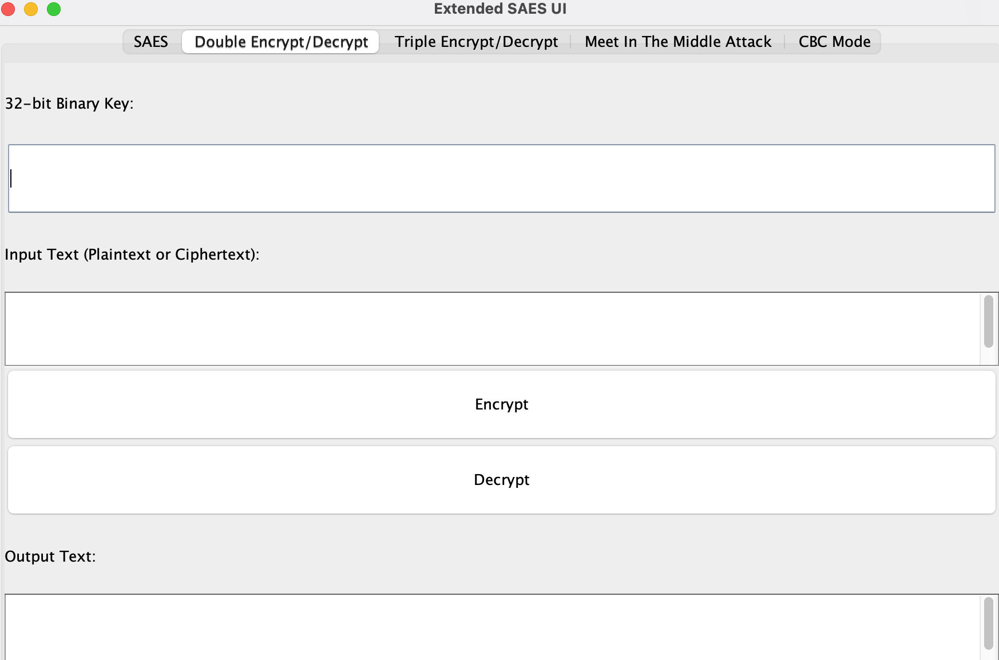

# SAES加密

## 概览
本项目为重庆大学信息安全导论课程的 Project，扩展SAES加密是一个交互式Java应用程序，为基于简化高级加密标准（SAES）的加密操作提供了一个用户友好的图形界面。这个教育工具扩展了基本的SAES实现，支持更复杂的操作，如双重和三重加密，同时实现了中间相遇攻击和CBC加解密。

## 功能特点

### SAES加密和解密
- 使用16位二进制密钥进行加密和解密。
- 提供了清晰的界面来输入密钥和文本，并显示输出结果。

### 双重加密和解密

- 通过将32位二进制密钥分成两个16位密钥来实现双重加密。本项目采用两次加密的方式。
- 密钥的每一半在两个连续的加密操作中使用。
- 解密过程使用相同的密钥反转加密步骤。

### 三重加密和解密

###                                                    

- 使用三个独立的16位密钥扩展到三层加密过程。
- 该过程涉及三个顺序的加密或解密操作。
- 通过多重加密阶段提高了安全性。

### 中途相遇攻击模拟
- 使用已知的明文-密文对分析和模拟中途相遇攻击。
- 攻击尝试找到导致已知密文的密钥对。

### CBC模式加密和解密
- 实现CBC模式，该模式链接明文和密文块，提高安全性。
- 支持输入初始化向量（IV）进行解密操作。
- 提供了生成随机IV的方法进行加密。

## 系统要求
- Java开发工具包（JDK）8或更高版本。
- Java运行环境（JRE）8或更高版本。

## 使用
要启动应用程序，请执行主类`UI`从您的Java运行环境。将会显示带有多个功能标签的应用程序窗口。

### 与UI交互
应用程序中的每个标签对应一个功能：

#### SAES标签
- 在指定字段中输入您的16位二进制密钥。

- 在输入文本区域中键入明文或密文。

- 点击`加密`或`解密`，在输出文本区域查看结果。

  

#### 双重加密/解密标签
- 提供一个32位二进制密钥。

- 输入明文或密文。

- 使用`加密`或`解密`按钮执行操作并查看输出结果。

  

#### 三重加密/解密标签
- 在相应的字段中输入三个单独的16位二进制密钥。

- 输入您的明文或密文。

- 点击`加密`或`解密`执行操作并显示结果。

  

#### 中途相遇攻击标签
- 输入已知的明文-密文对，每对一行。

- 点击`攻击`运行分析并显示可能的密钥。

  

#### CBC模式标签
- 输入一个16位二进制密钥，对于解密，还需提供IV。

- 输入您的明文或密文。

- 按下`加密`或`解密`开始CBC操作并展示输出。

  

  ### 交叉测试

  1.SAES

  

  

结果一致，通过验证。

2.双重加密

使用本项目进行加密，使用对方项目进行解密，可得到原始的明文，通过验证。

3.三重验证

由于两组使用的实现方法不同，无法验证。

## 贡献

我们鼓励您对扩展SAES加密UI的功能进行增强和扩展。请fork项目，进行更改，并提交带有清晰修改描述的pull请求。

